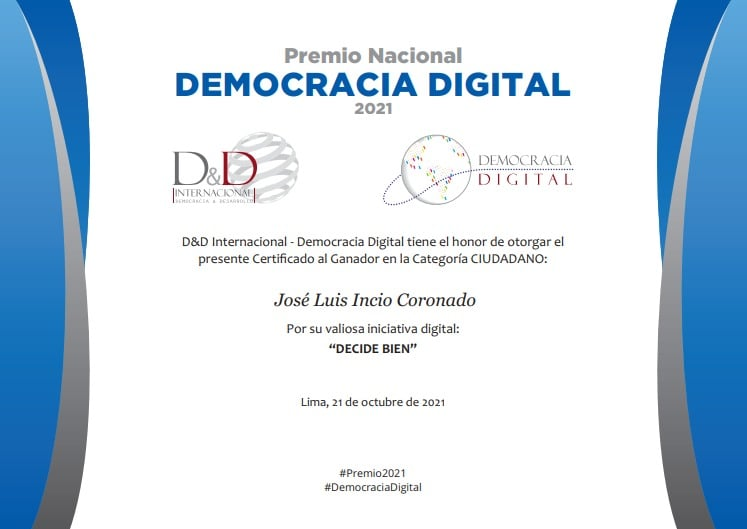

**DecidebienPe** is an initiative I created that aims to improve the linkage between Peruvian citizens and their parties and representatives. Started with an application that reduced the time and cognitive burden of processing candidates' information in the 2020 congressional elections. 

Thanks to the help of different organizations and volunteers DecidebienPe have developed and promoted different applications that use technology and data so citizens can demand  government's accountability 

For this initiative, I won the National Prize for Digital Democracy 2021. This contest is organized by the NGO [Democracia Digital](https://www.democraciadigital.pe/premio) and sponsored by Google, Lenovo, and Claro

